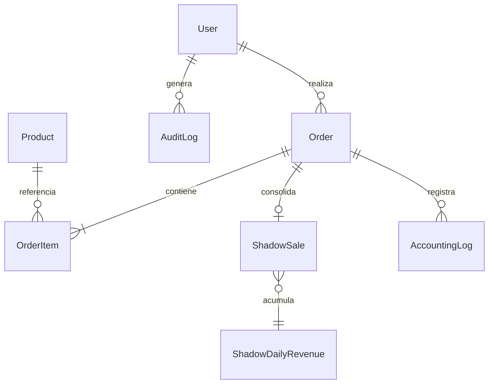
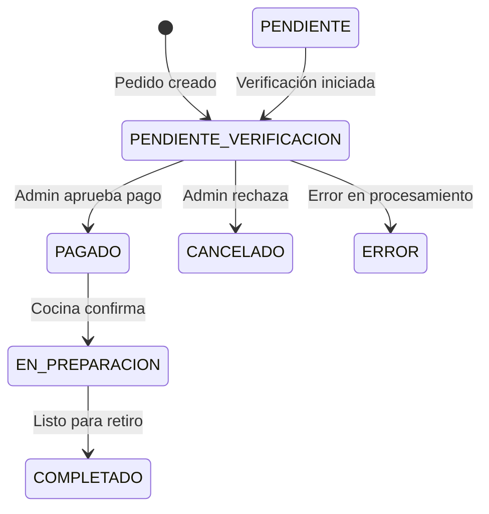
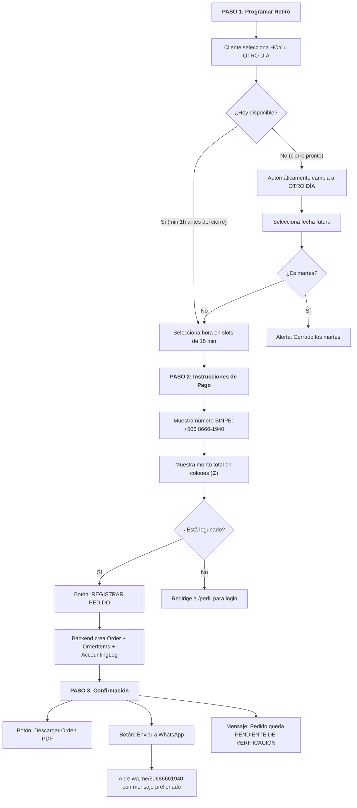
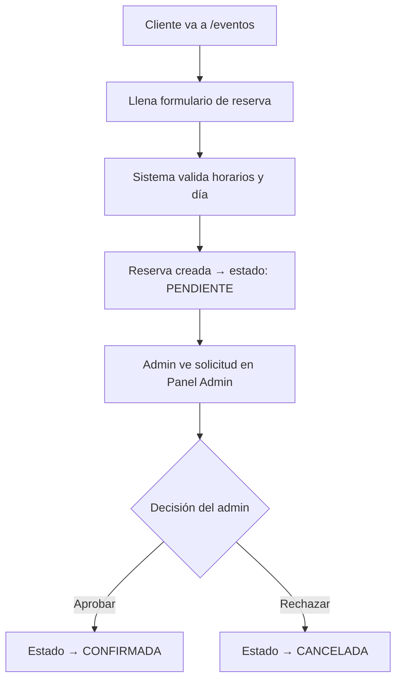
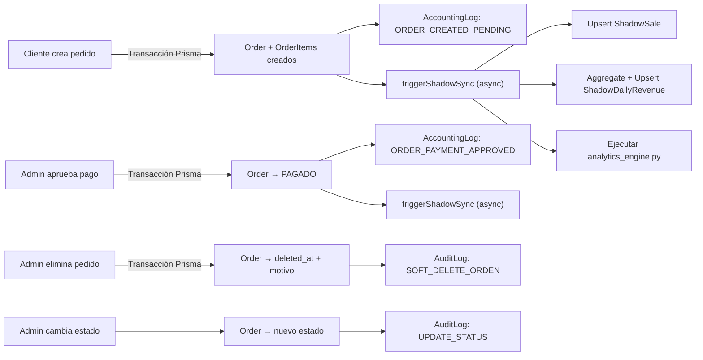

# Documento de Especificación de Requerimientos

## Aplicación Web — Mandy's Bar & Restaurante

**Versión:** 2.0  
**Fecha:** 27 de febrero de 2026  
**Autor:** Equipo de Desarrollo Mandy's Bar

---

## 1. Introducción

### 1.1. Propósito del Documento

Este documento establece los requisitos funcionales y no funcionales para la aplicación web de Mandy's Bar & Restaurante. Sirve como referencia técnica y funcional para el equipo de desarrollo, asegurando claridad y trazabilidad en cada módulo del sistema.

### 1.2. Alcance

La aplicación web permite a los **clientes** realizar pedidos con pago por SINPE Móvil, solicitar reservas, gestionar su perfil personal, y consultar información del restaurante (menú, galería, eventos, contacto). Los **administradores** y roles operativos gestionan pedidos, reservas, productos, reportes financieros y auditoría desde un panel dedicado.

### 1.3. Stack Tecnológico

| Capa               | Tecnología                                       | Notas                                  |
| ------------------ | ------------------------------------------------ | -------------------------------------- |
| **Frontend**       | React 19, TypeScript, Tailwind CSS, Vite 7       | SPA con lazy loading                   |
| **Componentes UI** | Radix UI, Lucide React, shadcn/ui, Framer Motion | Accesibilidad + animaciones            |
| **Formularios**    | React Hook Form + Zod v4                         | Validación en tiempo real              |
| **Backend**        | Express.js, Node.js                              | Servidor propio con API REST           |
| **ORM**            | Prisma ORM v7 con PostgreSQL                     | Migraciones y transacciones ACID       |
| **Autenticación**  | JWT (backend propio)                             | Tokens almacenados en localStorage     |
| **Reportes**       | jsPDF + jspdf-autotable (PDF), xlsx (Excel)      | Generación desde frontend y admin      |
| **Seguridad**      | Helmet, CORS, Rate Limiting, Morgan              | Headers seguros, logging, trazabilidad |

> **Nota importante:** El backend principal **NO** utiliza Supabase para operaciones CRUD (la persistencia y lógica central operan sobre **Express.js + Prisma ORM + PostgreSQL**). El frontend utiliza el cliente de Supabase exclusivamente para gestionar suscripciones en tiempo real (Realtime) mediante WebSockets, lo que permite que el panel administrativo (`AdminDashboard.tsx`) reciba actualizaciones de pedidos de forma instantánea sin comprometer el flujo de seguridad de la API. La autenticación es propia vía JWT.

---

## 2. Modelo de Datos

### 2.1. Diagrama de Entidades



### 2.2. Tabla: User (`users`)

| Campo            | Tipo            | Obligatorio | Descripción                                  |
| ---------------- | --------------- | ----------- | -------------------------------------------- |
| `id`             | UUID            | ✅          | Identificador único (auto-generado)          |
| `nombre`         | String          | ✅          | Nombre completo                              |
| `correo`         | String (unique) | ✅          | Correo electrónico                           |
| `telefono`       | String          | ❌          | Teléfono de contacto                         |
| `password_hash`  | String          | ✅          | Contraseña encriptada (bcrypt)               |
| `role`           | Enum            | ✅          | Rol del usuario (default: `USER`)            |
| `provincia`      | String          | ❌          | Provincia de Costa Rica                      |
| `canton`         | String          | ❌          | Cantón                                       |
| `distrito`       | String          | ❌          | Distrito                                     |
| `fecha_nac`      | DateTime        | ❌          | Fecha de nacimiento                          |
| `genero`         | String          | ❌          | Género del usuario                           |
| `num_documento`  | String          | ❌          | Número de documento de identidad             |
| `tipo_documento` | String          | ❌          | Tipo de documento (cédula, pasaporte, DIMEX) |
| `foto_perfil`    | String          | ❌          | URL de la foto de perfil                     |
| `created_at`     | DateTime        | ✅          | Fecha de registro (auto)                     |
| `updated_at`     | DateTime        | ✅          | Última actualización (auto)                  |

**Índices:** `role`

### 2.3. Tabla: Product (`products`)

| Campo            | Tipo     | Obligatorio | Descripción                                            |
| ---------------- | -------- | ----------- | ------------------------------------------------------ |
| `id`             | UUID     | ✅          | Identificador único                                    |
| `nombre`         | String   | ✅          | Nombre del producto                                    |
| `precio_con_iva` | Float    | ✅          | Precio con 13% IVA incluido                            |
| `categoria`      | String   | ✅          | Categoría (ejemplo: Bebidas, Entradas, Platos fuertes) |
| `imagen_url`     | String   | ❌          | URL de la imagen del producto                          |
| `activo`         | Boolean  | ✅          | Si el producto está disponible (default: `true`)       |
| `created_at`     | DateTime | ✅          | Fecha de creación (auto)                               |
| `updated_at`     | DateTime | ✅          | Última actualización (auto)                            |

**Índices:** `categoria`, `activo`

### 2.4. Tabla: Order (`orders`)

| Campo                | Tipo            | Obligatorio | Descripción                                                   |
| -------------------- | --------------- | ----------- | ------------------------------------------------------------- |
| `id`                 | UUID            | ✅          | Identificador único                                           |
| `consecutivo_anual`  | String (unique) | ✅          | Número de factura con formato `YYYY-NNNNN` (ej: `2026-00001`) |
| `user_id`            | String          | ❌          | Referencia al usuario (nullable para pedidos sin cuenta)      |
| `subtotal_sin_iva`   | Float           | ✅          | Subtotal sin impuestos                                        |
| `iva`                | Float           | ✅          | Monto del 13% de IVA                                          |
| `total`              | Float           | ✅          | Total con IVA (lo que paga el cliente)                        |
| `estado`             | Enum            | ✅          | Estado del pedido (default: `PENDIENTE`)                      |
| `pickup_time`        | DateTime        | ❌          | Hora programada de retiro                                     |
| `cliente_nombre`     | String          | ❌          | Nombre del cliente (para pedidos sin cuenta)                  |
| `cliente_telefono`   | String          | ❌          | Teléfono del cliente                                          |
| `deleted_at`         | DateTime        | ❌          | Marca de soft delete (null = activo)                          |
| `motivo_eliminacion` | String          | ❌          | Razón de eliminación (obligatorio para rol VENTAS)            |
| `fecha`              | DateTime        | ✅          | Fecha de creación del pedido (auto)                           |

**Índices:** `user_id`, `fecha`

### 2.5. Tabla: OrderItem (`order_items`)

| Campo            | Tipo   | Obligatorio | Descripción                                 |
| ---------------- | ------ | ----------- | ------------------------------------------- |
| `id`             | UUID   | ✅          | Identificador único                         |
| `order_id`       | String | ✅          | FK → Order (cascade delete)                 |
| `product_id`     | String | ✅          | FK → Product                                |
| `cantidad`       | Int    | ✅          | Unidades ordenadas                          |
| `precio_sin_iva` | Float  | ✅          | Precio unitario sin IVA: `precio / 1.13`    |
| `iva_linea`      | Float  | ✅          | IVA de esta línea: `(precio / 1.13) * 0.13` |
| `total_linea`    | Float  | ✅          | Total: `precio * cantidad`                  |

**Índices:** `order_id`, `product_id`

### 2.6. Tabla: Reservation (`reservations`)

| Campo         | Tipo     | Obligatorio | Descripción                                    |
| ------------- | -------- | ----------- | ---------------------------------------------- |
| `id`          | UUID     | ✅          | Identificador único                            |
| `nombre`      | String   | ✅          | Nombre del solicitante                         |
| `correo`      | String   | ✅          | Correo electrónico                             |
| `fecha`       | DateTime | ✅          | Fecha de la reserva                            |
| `hora_inicio` | String   | ✅          | Hora de inicio                                 |
| `hora_fin`    | String   | ✅          | Hora de finalización                           |
| `tipo_evento` | String   | ✅          | Tipo de evento (cumpleaños, corporativo, etc.) |
| `comensales`  | Int      | ✅          | Número de personas                             |
| `detalles`    | String   | ❌          | Información adicional                          |
| `estado`      | Enum     | ✅          | Estado (default: `PENDIENTE`)                  |
| `created_at`  | DateTime | ✅          | Fecha de creación (auto)                       |
| `updated_at`  | DateTime | ✅          | Última actualización (auto)                    |

### 2.7. Tablas de Auditoría y Analítica

| Tabla                                           | Propósito                                                                                                                                                                                            |
| ----------------------------------------------- | ---------------------------------------------------------------------------------------------------------------------------------------------------------------------------------------------------- |
| **AuditLog** (`audit_logs`)                     | Registra QUIÉN hizo QUÉ y CUÁNDO. Se crea automáticamente al cambiar estados de pedido, eliminar pedidos, o realizar operaciones administrativas. Campos: `usuario_que_modifica`, `accion`, `fecha`. |
| **AccountingLog** (`accounting_logs`)           | Log contable por pedido: se crea al crear un pedido (`ORDER_CREATED_PENDING`) y al aprobar pago (`ORDER_PAYMENT_APPROVED`). Campos: `order_id`, `action`, `total`, `details`.                        |
| **ShadowSale** (`shadow_sales`)                 | Consolidación de venta con datos del cliente (`total_consolidado`, `items_json`, `cliente_correo`, `cliente_nombre`). Se sincroniza automáticamente vía `triggerShadowSync()`.                       |
| **ShadowDailyRevenue** (`shadow_daily_revenue`) | Ingreso total por día (`fecha_dia`, `total_venta`). Se actualiza automáticamente.                                                                                                                    |
| **WebhookEvent** (`webhook_events`)             | Registro de eventos webhook procesados (`event_id`, `provider`, `status`). Previene duplicación de eventos.                                                                                          |

### 2.8. Enumeraciones

#### Roles de Usuario (`Role`)

| Rol       | Permisos                                                                                                             |
| --------- | -------------------------------------------------------------------------------------------------------------------- |
| `USER`    | Hacer pedidos, reservas, gestionar perfil, ver historial propio                                                      |
| `VENTAS`  | Todo de USER + cambiar estados de pedido + eliminar pedidos (excepto COMPLETADOS, requiere motivo mín. 5 caracteres) |
| `MANAGER` | Todo de VENTAS + gestión avanzada                                                                                    |
| `ADMIN`   | Acceso total: gestión de usuarios, productos, reportes, auditoría, panel de administración                           |

#### Estados de Pedido (`OrderStatus`)



| Estado                   | Descripción                                              |
| ------------------------ | -------------------------------------------------------- |
| `PENDIENTE`              | Default de base de datos. No se alcanza en el flujo estándar de checkout; el controlador crea los pedidos directamente como `PENDIENTE_VERIFICACION`. Reservado para posibles flujos futuros o creación manual. |
| `PENDIENTE_VERIFICACION` | Pedido enviado, esperando comprobante SINPE por WhatsApp |
| `PAGADO`                 | Pago verificado y aprobado por administrador             |
| `EN_PREPARACION`         | Pedido en preparación en cocina                          |
| `COMPLETADO`             | Pedido listo y entregado al cliente                      |
| `CANCELADO`              | Pedido cancelado (por admin o por rechazo de pago)       |
| `ERROR`                  | Error en el procesamiento del pedido                     |

#### Estados de Reserva (`ReservaStatus`)

| Estado       | Descripción                              |
| ------------ | ---------------------------------------- |
| `PENDIENTE`  | Reserva solicitada, esperando aprobación |
| `CONFIRMADA` | Reserva aprobada por administrador       |
| `CANCELADA`  | Reserva rechazada o cancelada            |

---

## 3. Cálculo de IVA

El sistema de impuestos sigue las reglas fiscales de Costa Rica con **IVA del 13%**.

### 3.1. Lógica de Cálculo

Los precios de los productos se almacenan **con IVA incluido** (`precio_con_iva`). El desglose fiscal se calcula en el backend al crear el pedido mediante **cálculo inverso**:

```
subtotal_sin_iva = totalWithIVA / 1.13
iva = subtotal_sin_iva * 0.13
total = totalWithIVA  (lo que paga el cliente)
```

### 3.2. IVA por Línea de Pedido

Cada `OrderItem` también calcula su IVA individual:

```
precio_sin_iva = itemPrice / 1.13
iva_linea = (itemPrice / 1.13) * 0.13
total_linea = itemPrice * cantidad
```

### 3.3. Consecutivo Anual

Cada pedido recibe un número consecutivo único con formato `YYYY-NNNNN` (ejemplo: `2026-00042`). Se genera atómicamente dentro de una transacción Prisma para evitar duplicados.

---

## 4. Requerimientos Funcionales

### 4.1. Módulo de Pedidos

#### 4.1.1. Descripción

El cliente navega el menú digital, agrega productos al carrito, selecciona fecha/hora de retiro, y paga por SINPE Móvil. El comprobante de pago se envía por WhatsApp.

#### 4.1.2. Requerimientos Detallados

| ID            | Requerimiento                                                                                                                            |
| ------------- | ---------------------------------------------------------------------------------------------------------------------------------------- |
| **RF-PED-01** | El menú digital muestra productos **activos** agrupados por categoría con imagen, nombre y precio con IVA.                               |
| **RF-PED-02** | El carrito persiste en la sesión del usuario mediante `CartContext` (React Context).                                                     |
| **RF-PED-03** | El cliente puede ajustar cantidades desde el carrito lateral (`CartDrawer`).                                                             |
| **RF-PED-04** | Al checkout, el sistema calcula automáticamente: subtotal sin IVA, IVA (13%) y total.                                                    |
| **RF-PED-05** | El cliente selecciona fecha y hora de retiro. Mínimo **1 hora de preparación** desde el momento actual.                                  |
| **RF-PED-06** | El sistema valida horarios contra el horario de operación del restaurante (ver sección 5).                                               |
| **RF-PED-07** | El sistema genera un consecutivo anual único (`YYYY-NNNNN`) dentro de una transacción atómica.                                           |
| **RF-PED-08** | El sistema resuelve productos por UUID o por nombre (búsqueda insensible a mayúsculas/minúsculas) para sincronización con menú estático. |
| **RF-PED-09** | El pedido se crea con estado inicial `PENDIENTE_VERIFICACION` y se registra automáticamente en `AccountingLog`.                          |
| **RF-PED-10** | Se ejecuta `ShadowSync` en segundo plano (no bloqueante) para actualizar las tablas analíticas.                                          |

#### 4.1.3. Flujo de Pedido (3 pasos)



---

### 4.2. Integración con WhatsApp

#### 4.2.1. Mecanismo

La integración con WhatsApp **NO es una API directa**. Es un **redireccionamiento** al cliente de WhatsApp (web o app) usando la URL `https://wa.me/50686661940` con un mensaje prellenado mediante query parameter `text`.

#### 4.2.2. Contenido del Mensaje Prellenado

```
¡Hola Mandy's Bar! 👋

He registrado mi Orden de Pedido #2026-00042.

*Resumen de mi pedido:*
▪️ 2x Hamburguesa Clásica (- ₡6,500)
▪️ 1x Cerveza Artesanal (- ₡3,200)

*Total a pagar:* ₡16,200
*Retiro:* 27/02 14:30

⚠️ *Aviso:* En horas pico, el pedido puede tardar un poco más de lo habitual.

Quedo a la espera de su confirmación.
```

#### 4.2.3. Flujo Posterior

1. El cliente envía el mensaje prellenado + screenshot del comprobante SINPE a través de WhatsApp.
2. El administrador verifica el pago manualmente.
3. El administrador aprueba el pedido desde el Panel de Administración → estado cambia a **`PAGADO`**.
4. Se crea un `AccountingLog` con acción `ORDER_PAYMENT_APPROVED`.

---

### 4.3. Módulo de Reservas

#### 4.3.1. Descripción

El cliente solicita una reserva indicando fecha, hora, tipo de evento y número de comensales.

#### 4.3.2. Requerimientos

| ID            | Requerimiento                                                                                                       |
| ------------- | ------------------------------------------------------------------------------------------------------------------- |
| **RF-RES-01** | Formulario solicita: nombre, correo, fecha, hora inicio, hora fin, tipo de evento, comensales, detalles (opcional). |
| **RF-RES-02** | El sistema valida que la fecha/hora esté dentro del horario de operación (ver sección 5).                           |
| **RF-RES-03** | Las reservas se crean con estado `PENDIENTE`.                                                                       |
| **RF-RES-04** | El administrador puede cambiar el estado a `CONFIRMADA` o `CANCELADA` desde el panel.                               |
| **RF-RES-05** | La página `/eventos` muestra información de eventos y el formulario de reserva.                                     |

#### 4.3.3. Flujo de Reserva



---

### 4.4. Módulo de Perfil de Usuario

#### 4.4.1. Requerimientos

| ID            | Requerimiento                                                                                                                            |
| ------------- | ---------------------------------------------------------------------------------------------------------------------------------------- |
| **RF-PER-01** | El usuario puede editar: nombre, correo, teléfono, provincia, cantón, distrito, fecha de nacimiento, género, número y tipo de documento. |
| **RF-PER-02** | El usuario puede subir y cambiar su foto de perfil (vía `/api/upload`).                                                                  |
| **RF-PER-03** | El usuario puede consultar su historial de pedidos y reservas.                                                                           |
| **RF-PER-04** | La autenticación se maneja con JWT almacenado en `localStorage` (key: `mandys_auth_token`).                                              |
| **RF-PER-05** | El estado de autenticación se distribuye vía `AuthContext` (React Context).                                                              |

---

### 4.5. Panel de Administración

#### 4.5.1. Acceso

Ruta: `/admin` — Protegida por componente `AdminRoute` que verifica **roles operativos autorizados: `ADMIN`, `MANAGER` o `VENTAS`**.

#### 4.5.2. Requerimientos

| ID            | Requerimiento                                                                                                 |
| ------------- | ------------------------------------------------------------------------------------------------------------- |
| **RF-ADM-01** | **Gestión de pedidos:** ver todos, aprobar pago, rechazar, cambiar estado, eliminar (soft delete con motivo). |
| **RF-ADM-02** | **Gestión de reservas:** ver solicitudes, aprobar o rechazar.                                                 |
| **RF-ADM-03** | **Gestión de productos:** crear, editar, activar/desactivar.                                                  |
| **RF-ADM-04** | **Gestión de usuarios:** ver lista, cambiar roles.                                                            |
| **RF-ADM-05** | **Reportes financieros:** generar en PDF (jsPDF) y Excel (xlsx).                                              |
| **RF-ADM-06** | **Auditoría:** consultar historial de `AuditLog` (quién modificó qué).                                        |
| **RF-ADM-07** | **Dashboard analítico:** métricas de ventas diarias vía `ShadowDailyRevenue`.                                 |

#### 4.5.3. Reglas de Negocio para Eliminación de Pedidos

| Rol                 | Regla                                                                                                |
| ------------------- | ---------------------------------------------------------------------------------------------------- |
| `ADMIN` / `MANAGER` | Puede eliminar cualquier pedido (soft delete)                                                        |
| `VENTAS`            | Puede eliminar pedidos **excepto** los `COMPLETADOS`. Obligatorio indicar motivo (mín. 5 caracteres) |
| `USER`              | No puede eliminar pedidos                                                                            |

---

### 4.6. Módulo de Productos

| ID            | Requerimiento                                                                            |
| ------------- | ---------------------------------------------------------------------------------------- |
| **RF-PRO-01** | CRUD completo vía API `/api/products`.                                                   |
| **RF-PRO-02** | Los productos tienen: nombre, categoría, precio con IVA, imagen, estado activo/inactivo. |
| **RF-PRO-03** | Solo productos con `activo = true` se muestran en el menú del cliente.                   |
| **RF-PRO-04** | Las imágenes se suben vía `/api/upload` y se sirven estáticamente desde `/uploads/`.     |

---

### 4.7. Páginas del Frontend

| Ruta        | Página          | Descripción                                                           |
| ----------- | --------------- | --------------------------------------------------------------------- |
| `/`         | Home            | Landing page con hero slider animado y secciones destacadas           |
| `/menu`     | Menú            | Catálogo de productos activos por categoría, con carrito lateral      |
| `/eventos`  | Eventos         | Información de eventos + formulario de reserva                        |
| `/galeria`  | Galería         | Galería circular interactiva de imágenes (`CircularGallery`)          |
| `/acerca`   | Acerca de       | Historia e información del restaurante                                |
| `/contacto` | Contacto        | Formulario e información de contacto                                  |
| `/perfil`   | Perfil          | Registro, login, edición de datos, historial (requiere autenticación) |
| `/admin`    | Dashboard Admin | Panel completo de administración (requiere **rol operativo autorizado**)               |

**Lazy Loading:** Todas las páginas usan `React.lazy()` + `Suspense` con un spinner de carga.

---

## 5. Horarios de Operación

### 5.1. Configuración (archivo `src/lib/hours.ts`)

| Día           | Horario             | Estado      |
| ------------- | ------------------- | ----------- |
| **Lunes**     | 12:00 md – 11:00 pm | Abierto     |
| **Martes**    | —                   | **CERRADO** |
| **Miércoles** | 12:00 md – 11:00 pm | Abierto     |
| **Jueves**    | 12:00 md – 11:00 pm | Abierto     |
| **Viernes**   | 12:00 md – 12:00 mn | Abierto     |
| **Sábado**    | 12:00 md – 12:00 mn | Abierto     |
| **Domingo**   | 12:00 md – 12:00 mn | Abierto     |

### 5.2. Reglas de Validación

- **Martes:** El sistema no genera slots de tiempo y muestra alerta de cierre si el usuario intenta seleccionar un martes.
- **Hoy:** Los slots disponibles comienzan **mínimo 1 hora** después de la hora actual, redondeados al siguiente bloque de **15 minutos**.
- **Cierre inminente:** Si no hay tiempo suficiente para preparar (menos de 1 hora antes del cierre), el sistema cambia automáticamente a "Otro día".
- **Otro día:** Se muestran todos los slots del día seleccionado, desde las 12:00 hasta la hora de cierre correspondiente.
- **Formato de slots:** Intervalos de 15 minutos (12:00, 12:15, 12:30, 12:45, 13:00...).
- **Formato de display:** Hora 12 con sufijos `md` (mediodía), `pm`, `am`, `mn` (medianoche).

---

## 6. Requerimientos No Funcionales

### 6.1. Seguridad

| ID             | Requerimiento              | Implementación                                                      |
| -------------- | -------------------------- | ------------------------------------------------------------------- |
| **RNF-SEG-01** | Autenticación segura       | JWT con tokens en `Authorization: Bearer` header                    |
| **RNF-SEG-02** | Protección de headers HTTP | Helmet con CSP, CORS configurado                                    |
| **RNF-SEG-03** | Rate limiting diferenciado | `authRateLimiter` (más restrictivo) y `orderRateLimiter`            |
| **RNF-SEG-04** | Límite de payload          | `express.json({ limit: '10kb' })`                                   |
| **RNF-SEG-05** | Trazabilidad de peticiones | Request ID (UUID v4) en header `X-Request-Id`                       |
| **RNF-SEG-06** | Autorización por roles     | 4 roles con permisos diferenciados (ver sección 2.8)                |
| **RNF-SEG-07** | Rutas protegidas           | Middleware `auth` + verificación de rol en controllers              |
| **RNF-SEG-08** | Soft delete                | Pedidos no se eliminan físicamente, se marcan con `deleted_at`      |
| **RNF-SEG-09** | CORS                       | Configurado actualmente para desarrollo local (`http://localhost:5173`). En despliegue a producción se ajustará a los dominios/subdominios aprobados según la etapa de evolución (ver sección 8.3). |

### 6.2. Rendimiento

| ID             | Requerimiento             | Implementación                                                                |
| -------------- | ------------------------- | ----------------------------------------------------------------------------- |
| **RNF-REN-01** | Carga rápida del frontend | Lazy loading con `React.lazy()` + `Suspense`                                  |
| **RNF-REN-02** | Consultas eficientes      | Índices en PostgreSQL (`user_id`, `fecha`, `categoria`, `activo`, `order_id`) |
| **RNF-REN-03** | Tiempo de carga inicial   | < 3 segundos                                                                  |
| **RNF-REN-04** | Respuesta de API          | < 500ms para operaciones CRUD                                                 |
| **RNF-REN-05** | Transacciones con timeout | Prisma transactions con `maxWait: 5000ms`, `timeout: 10000ms`                 |

### 6.3. Observabilidad

| ID             | Requerimiento           | Implementación                                                          |
| -------------- | ----------------------- | ----------------------------------------------------------------------- |
| **RNF-OBS-01** | Logging estructurado    | Morgan con formato personalizado incluyendo Request ID                  |
| **RNF-OBS-02** | Rotación de logs        | `rotating-file-stream`: 100MB max, 1 rotación/día, 14 días retención    |
| **RNF-OBS-03** | Health check            | `GET /api/healthz` → `{ status: 'OK', timestamp }`                      |
| **RNF-OBS-04** | Readiness check         | `GET /api/readyz` → verifica conexión a PostgreSQL vía Prisma           |
| **RNF-OBS-05** | Auditoría de acciones   | `AuditLog` para modificaciones de pedidos y operaciones administrativas |
| **RNF-OBS-06** | Contabilidad automática | `AccountingLog` para creación y aprobación de pedidos                   |

### 6.4. Usabilidad

| ID             | Requerimiento                                                              |
| -------------- | -------------------------------------------------------------------------- |
| **RNF-USA-01** | Diseño responsive (mobile-first) con Tailwind CSS                          |
| **RNF-USA-02** | Animaciones fluidas con Framer Motion y CSS transitions                    |
| **RNF-USA-03** | Validación de formularios en tiempo real (React Hook Form + Zod)           |
| **RNF-USA-04** | Estados de carga, error y vacío en todos los componentes                   |
| **RNF-USA-05** | Interfaz completamente en español (Costa Rica)                             |
| **RNF-USA-06** | Accesibilidad: atributos ARIA en botones, formularios y modales (Radix UI) |
| **RNF-USA-07** | Generación de PDF de orden descargable para el cliente                     |

---

## 7. API Routes

### 7.1. Rutas Públicas (sin autenticación)

| Método | Ruta                 | Descripción                    |
| ------ | -------------------- | ------------------------------ |
| `POST` | `/api/auth/register` | Registro publico deshabilitado |
| `POST` | `/api/auth/login`    | Inicio de sesión → retorna JWT |
| `GET`  | `/api/products`      | Listar productos activos       |
| `POST` | `/api/reservations`  | Crear solicitud de reserva     |
| `GET`  | `/api/healthz`       | Health check del servidor      |
| `GET`  | `/api/readyz`        | Readiness check (verifica DB)  |

### 7.2. Rutas Autenticadas (requieren JWT)

| Método | Ruta           | Roles Autorizados | Descripción                      |
| ------ | -------------- | ---------- | -------------------------------- |
| `POST` | `/api/orders`  | `USER`     | Crear pedido                     |
| `GET`  | `/api/profile` | `USER`     | Obtener perfil propio            |
| `PUT`  | `/api/profile` | `USER`     | Actualizar perfil                |
| `POST` | `/api/upload`  | `USER`     | Subir imagen (perfil o producto) |

### 7.3. Rutas Administrativas (requieren rol ADMIN/MANAGER/VENTAS)

| Método   | Ruta                      | Roles Autorizados | Descripción               |
| -------- | ------------------------- | ---------- | ------------------------- |
| `GET`    | `/api/orders`             | `VENTAS`   | Listar todos los pedidos  |
| `PUT`    | `/api/orders/status/:id`  | `ADMIN`, `MANAGER`, `VENTAS` | Cambiar estado de pedido  |
| `PUT`    | `/api/orders/approve/:id` | `ADMIN`, `MANAGER`, `VENTAS` | Aprobar pago de pedido    |
| `DELETE` | `/api/orders/:id`         | `VENTAS`   | Soft delete de pedido     |
| `GET`    | `/api/reservations`       | `ADMIN`    | Listar todas las reservas |
| `GET`    | `/api/users`              | `ADMIN`    | Listar todos los usuarios |

### 7.4. Archivos Estáticos

| Ruta         | Descripción                                   |
| ------------ | --------------------------------------------- |
| `/uploads/*` | Imágenes subidas (fotos de perfil, productos) |

---

## 8. Consideraciones de Arquitectura

### 8.1. Separación de Responsabilidades

```
Frontend (React)           Backend (Express.js)          Base de Datos (PostgreSQL)
┌─────────────────┐       ┌──────────────────────┐       ┌─────────────────┐
│ Pages (UI pura)  │──────▶│ Routes               │──────▶│ Prisma ORM      │
│ Contexts (estado)│       │ Controllers (lógica)  │       │ Migrations      │
│ Components       │       │ Middlewares (auth/log)│       │ Transactions    │
│ Lib (utilidades) │       │ Services (sync)       │       │ Índices         │
└─────────────────┘       └──────────────────────┘       └─────────────────┘
```

### 8.2. Principios de Diseño

- **Inmutabilidad:** Los estados de pedidos y reservas siguen transiciones definidas, no pueden saltarse estados.
- **Atomicidad:** Creación de pedidos + items + log contable dentro de una transacción Prisma.
- **Código auto-documentado:** Nombres descriptivos en español (`createOrder`, `validatePayment`, `motivo_eliminacion`).
- **Componentización:** Componentes reutilizables (`CartDrawer`, `CheckoutModal`, `MenuItemCard`, `StyledOrderButton`).
- **Early Return:** Validaciones negativas primero, "camino feliz" después.
- **Soft Delete:** Pedidos nunca se eliminan físicamente, siempre se marcan con `deleted_at`.

### 8.3. Etapas de Evolución de la Arquitectura

Para asegurar la escalabilidad operativa y la seguridad del sistema sin interrumpir el desarrollo actual, se ha definido la siguiente ruta evolutiva:

1.  **Arquitectura Actual:** Aplicación unificada (SPA). Los módulos de cliente y administración (`AdminRoute.tsx`, `AdminDashboard.tsx`) comparten el mismo entorno y despliegue actual.
2.  **Arquitectura Objetivo:** Separación física de la aplicación en dos aplicaciones frontend separadas: **Frontend Cliente** (público) y **Frontend Admin** (sistema interno o dashboard operativo), ambas consumiendo la API centralizada.
3.  **Etapa 1 (Aprobada / en ejecución):** Reorganización Interna. Refactorización para modularizar la SPA actual separando componentes por capas y dominios, preparando el código de vistas monolíticas para su futura extracción técnica.
4.  **Etapa 2 (Siguiente):** Separación Física. División del ecosistema frontend en aplicaciones independientes, ajustando el modelo de despliegue y los dominios o subdominios correspondientes.

---

## 9. Pipeline de Analítica y Auditoría

Las tablas `ShadowSale`, `ShadowDailyRevenue`, `AccountingLog` y `AuditLog` no son independientes: están **integradas directamente en el ciclo de vida del pedido** mediante el servicio `syncService.ts`.

### 9.1. Puntos de Integración en el Ciclo de Vida del Pedido



### 9.2. Detalle de `triggerShadowSync(orderId)`

Esta función se ejecuta **de forma asíncrona** (no bloqueante para el cliente) y realiza 3 operaciones:

| Paso  | Operación                   | Tabla Destino          | Detalle                                                                                                                       |
| ----- | --------------------------- | ---------------------- | ----------------------------------------------------------------------------------------------------------------------------- |
| **1** | Upsert `ShadowSale`         | `shadow_sales`         | Consolida datos del pedido: total, nombre/correo/teléfono del cliente (prioriza datos de usuario registrado), items como JSON |
| **2** | Aggregate + Upsert diario   | `shadow_daily_revenue` | Suma todos los pedidos activos (`deleted_at = null`) del día actual y upsert al registro diario                               |
| **3** | Ejecutar motor de analítica | Script Python          | Ejecuta `scripts/analytics_engine.py` de forma asíncrona con `child_process.exec`                                             |

### 9.3. Cuándo se Dispara

| Evento                  | AccountingLog                                          | AuditLog                                          | ShadowSync                   |
| ----------------------- | ------------------------------------------------------ | ------------------------------------------------- | ---------------------------- |
| Pedido creado           | ✅ `ORDER_CREATED_PENDING` (dentro de la transacción)  | —                                                 | ✅ Después de la transacción |
| Pago aprobado           | ✅ `ORDER_PAYMENT_APPROVED` (dentro de la transacción) | —                                                 | ✅ Después de la transacción |
| Estado cambiado         | —                                                      | ✅ `UPDATE_STATUS`                                | —                            |
| Pedido eliminado (soft) | —                                                      | ✅ `SOFT_DELETE_ORDEN` (dentro de la transacción) | —                            |

### 9.4. Consistencia de Datos

- **AccountingLog** y **AuditLog** se crean **dentro de la transacción Prisma** (consistencia garantizada). Si la transacción falla, ni el pedido ni el log se persisten.
- **ShadowSync** se ejecuta **fuera de la transacción** (eventual consistency). Si falla, el pedido no se afecta, pero las tablas analíticas pueden quedar temporalmente desactualizadas.
- **ShadowDailyRevenue** recalcula el total del día completo en cada sincronización, lo que corrige automáticamente cualquier inconsistencia previa.

---

## 10. Plan de Pruebas End-to-End (e2e)

### 10.1. Herramientas

| Herramienta                  | Propósito                                                          |
| ---------------------------- | ------------------------------------------------------------------ |
| **Playwright**               | Tests e2e del frontend (navegación, formularios, flujos completos) |
| **Puppeteer** (ya instalado) | Generación de screenshots, testing alternativo                     |
| **Pruebas manuales**         | Flujos de pago SINPE y WhatsApp (no automatizables)                |

### 10.2. Casos de Prueba — Frontend

| ID         | Flujo                    | Pasos                                                                                                           | Resultado Esperado                                                                           |
| ---------- | ------------------------ | --------------------------------------------------------------------------------------------------------------- | -------------------------------------------------------------------------------------------- |
| **E2E-01** | Navegación completa      | Visitar todas las rutas (`/`, `/menu`, `/eventos`, `/galeria`, `/acerca`, `/contacto`)                          | Todas las páginas cargan sin errores, lazy loading funciona                                  |
| **E2E-02** | Registro de usuario      | Ir a `/perfil` → completar formulario de registro → submit                                                      | Usuario creado, JWT almacenado, redirección a perfil                                         |
| **E2E-03** | Login y sesión           | Login con credenciales válidas → navegar → refrescar página                                                     | Sesión persiste vía `localStorage`, navbar muestra usuario                                   |
| **E2E-04** | Flujo de pedido completo | Menú → agregar productos → carrito → checkout paso 1 (hora) → paso 2 (pago) → registrar → paso 3 (confirmación) | Pedido creado con estado `PENDIENTE_VERIFICACION`, PDF descargable, botón WhatsApp funcional |
| **E2E-05** | Validación de horarios   | Intentar seleccionar martes / hora pasada / cierre inminente                                                    | Sistema bloquea martes, no muestra slots pasados, redirige a "otro día"                      |
| **E2E-06** | Carrito vacío            | Intentar hacer checkout sin productos                                                                           | Botón de checkout deshabilitado o muestra alerta                                             |
| **E2E-07** | Edición de perfil        | Editar nombre, teléfono, provincia → guardar                                                                    | Datos actualizados correctamente en la DB                                                    |
| **E2E-08** | Subida de foto de perfil | Subir imagen en `/perfil`                                                                                       | Imagen visible como foto de perfil                                                           |
| **E2E-09** | Formulario de reserva    | Ir a `/eventos` → llenar formulario → enviar                                                                    | Reserva creada con estado `PENDIENTE`                                                        |
| **E2E-10** | Responsive               | Ejecutar cada flujo en viewport móvil (375px) y desktop (1440px)                                                | UI se adapta correctamente sin elementos rotos                                               |

### 10.3. Casos de Prueba — Panel Admin

| ID             | Flujo                    | Pasos                                                          | Resultado Esperado                          |
| -------------- | ------------------------ | -------------------------------------------------------------- | ------------------------------------------- |
| **E2E-ADM-01** | Acceso protegido         | Intentar acceder a `/admin` sin rol operativo autorizado       | Redirección o error 403                     |
| **E2E-ADM-02** | Aprobar pedido           | Ver pedido pendiente → clic aprobar                            | Estado → **`PAGADO`**, AccountingLog creado |
| **E2E-ADM-03** | Eliminar pedido (VENTAS) | Intentar eliminar pedido COMPLETADO con rol VENTAS             | Sistema rechaza con error 403               |
| **E2E-ADM-04** | Eliminar pedido (ADMIN)  | Eliminar pedido con motivo                                     | Soft delete correcto, AuditLog creado       |
| **E2E-ADM-05** | Gestión de productos     | Crear producto → desactivar → verificar que no aparece en menú | Producto no visible para clientes           |
| **E2E-ADM-06** | Generar reporte          | Generar PDF y Excel de ventas                                  | Archivos descargados con datos correctos    |
| **E2E-ADM-07** | Gestión de reservas      | Aprobar/rechazar reserva pendiente                             | Estado actualizado correctamente            |

### 10.4. Casos de Prueba — API (Backend)

| ID         | Endpoint                  | Test                                      | Resultado Esperado          |
| ---------- | ------------------------- | ----------------------------------------- | --------------------------- |
| **API-01** | `POST /api/auth/register` | Intento de registro publico               | 403 Forbidden               |
| **API-02** | `POST /api/auth/login`    | Login válido / inválido                   | 200 + JWT / 401             |
| **API-03** | `POST /api/orders`        | Crear pedido sin token                    | 401 Unauthorized            |
| **API-04** | `POST /api/orders`        | Crear pedido con producto inexistente     | 500 con mensaje descriptivo |
| **API-05** | `DELETE /api/orders/:id`  | Eliminar pedido COMPLETADO con rol VENTAS | 403 Forbidden               |
| **API-06** | `DELETE /api/orders/:id`  | Eliminar con motivo < 5 chars (VENTAS)    | 400 Bad Request             |
| **API-07** | `GET /api/healthz`        | Health check                              | 200 OK                      |
| **API-08** | `GET /api/readyz`         | Readiness (DB conectada / desconectada)   | 200 READY / 503 NOT_READY   |

### 10.5. Pruebas Manuales (No Automatizables)

| ID         | Flujo                                  | Motivo                                     |
| ---------- | -------------------------------------- | ------------------------------------------ |
| **MAN-01** | Pago por SINPE Móvil                   | Requiere interacción con app bancaria real |
| **MAN-02** | Envío de comprobante por WhatsApp      | Requiere WhatsApp real en dispositivo      |
| **MAN-03** | Recepción de notificación por WhatsApp | Depende de operador humano (admin)         |

---

## 11. Cronograma de Implementación

| Fase                     | Estado         | Descripción                                    | Notas                      |
| ------------------------ | -------------- | ---------------------------------------------- | -------------------------- |
| Fase 1 — UI/UX           | ✅ Completa    | Home, Menú, Galería, Contacto, Eventos, About  | Responsive con animaciones |
| Fase 2 — Auth y Perfiles | ✅ Completa    | JWT, AuthContext, ProfilePage completa         | 4 roles implementados      |
| Fase 3 — Pedidos         | ✅ Completa    | Carrito, Checkout 3 pasos, SINPE, WhatsApp     | IVA 13%, consecutivo anual |
| Fase 4 — Reservas        | ✅ Completa    | Formulario, validación horarios, estados       | Tipos de evento            |
| Fase 5 — Panel Admin     | ✅ Completa    | Pedidos, reservas, productos, usuarios         | Soft delete con auditoría  |
| Fase 6 — Reportes        | ✅ Completa    | PDF factura, Excel ventas                      | jsPDF + xlsx               |
| Fase 7 — Seguridad       | ✅ Completa    | Helmet, Rate Limiting, AuditLog, Health Checks | Logging con rotación       |
| Fase 8 — Automatización  | 🔄 En progreso | Workflows n8n para procesamiento               | Integración n8n-mcp        |
| Fase 9 — Pruebas e2e     | ⏳ Pendiente   | Tests de integración completos                 | Playwright previsto        |
| Fase 10 — Producción     | ⏳ Pendiente   | Deploy con dominio y SSL                       | Hosting por definir        |

---

## 12. Consideraciones Finales

- **Feedback constante:** Iteración continua con usuarios para mejorar UX y funcionalidad.
- **Escalabilidad:** La arquitectura Express + Prisma + PostgreSQL permite escalar el backend horizontalmente y la base de datos verticalmente.
- **Mantenibilidad:** Separación clara en controllers, routes, middlewares y services facilita modificaciones sin efectos colaterales.
- **Cumplimiento fiscal:** El sistema calcula IVA al 13% según normativa costarricense, con desglose por línea de pedido.
- **Trazabilidad completa:** Cada pedido tiene consecutivo anual, logs de auditoría, logs contables y sincronización a tablas analíticas.

> Este Documento de Especificación sirve como base para el desarrollo, mantenimiento y futuras extensiones de la aplicación de Mandy's Bar & Restaurante.
